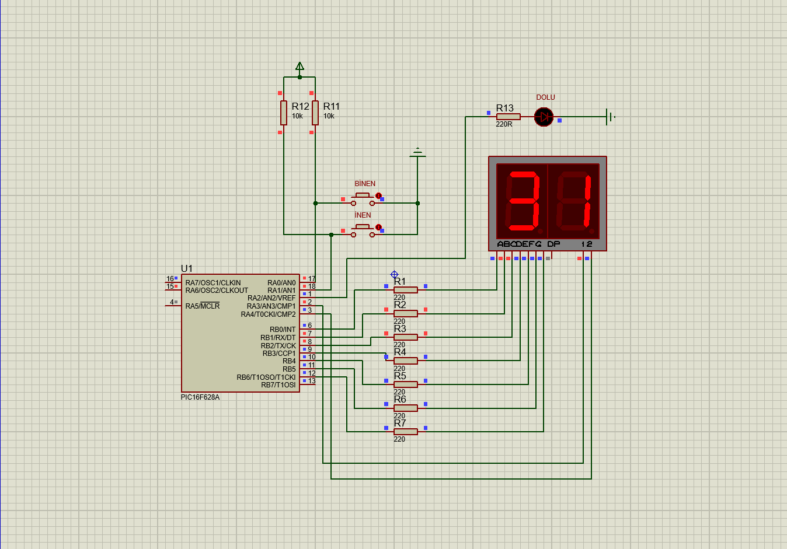

# Embedded-Passenger-Counter-PIC16F628A
A passenger counter system for public buses using PIC16F628A and Assembly.
# 🚌 Passenger Counter System for Public Transport / Toplu Taşıma Yolcu Sayacı

[Türkçe açıklamalar için aşağı kaydırın / Scroll down for Turkish]

## 🇺🇸 Project Overview
This project is an automation system designed to track and manage the number of passengers on a public bus using the **PIC16F628A** microcontroller.

### 📋 Key Features
- **Maximum Capacity:** 100 passengers.
- **Entry/Exit Control:** Independently tracks passengers entering from the front door and exiting from the middle/rear doors.
- **Visual Feedback:** Real-time passenger count is displayed on two **7-segment displays** using the **multiplexing** technique.
- **Alert System:** A "FULL" indicator lights up and prevents further entry once the bus reaches its 100-passenger limit.

### 🛠 Technical Details
- **Hardware:** PIC16F628A, 7-Segment Displays, Buttons.
- **Language:** Assembly (MPASM).
- **Logic:** Register-level programming, bank switching, and manual decimal-to-BCD conversion for display output.

---

## 🇹🇷 Proje Hakkında
Bu proje, **PIC16F628A** mikrodenetleyicisi kullanılarak, bir halk otobüsündeki yolcu sayısını takip etmek ve yönetmek için tasarlanmış bir otomasyon sistemidir.

### 📋 Özellikler
- **Maksimum Kapasite:** 100 yolcu sınırı.
- **Giriş/Çıkış Kontrolü:** Ön kapıdan binen ve orta/arka kapıdan inen yolcuları bağımsız olarak takip eder.
- **Görsel Geri Bildirim:** Yolcu sayısı, **multiplexing (tarama)** tekniği kullanılarak iki adet **7-segment display** üzerinde anlık olarak gösterilir.
- **Uyarı Sistemi:** Kapasite 100'e ulaştığında "DOLU" uyarısı aktifleşir ve yeni yolcu girişini simülasyon üzerinde durdurur.

### 🛠 Teknik Detaylar
- **Donanım:** PIC16F628A, 7-Segment Display, Butonlar.
- **Dil:** Assembly (MPASM).
- **Yöntem:** Register seviyesinde programlama, bank seçimi ve display sürüşü için tarama algoritması.

---

## 📸 Circuit Diagram / Devre Şeması

## 🚀 Simulation / Simülasyon
1. Projeyi **Proteus ISIS** üzerinde açın. / Open the project in Proteus.
2. `.asm` kodundan derlenen `.hex` dosyasını PIC16F628A'ya yükleyin. / Load the compiled `.hex` file.
3. Giriş ve çıkış butonlarını kullanarak simülasyonu test edin. / Test using entry and exit buttons.
